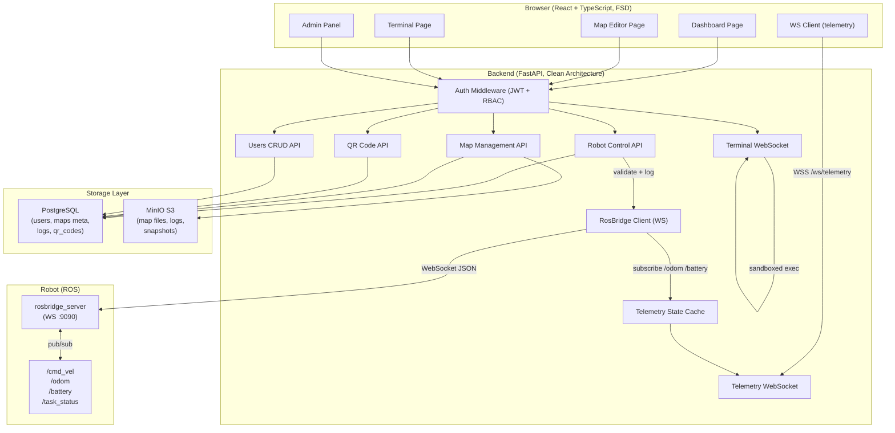

# CucumberBot Web — Architecture Overview

## Component Interaction Diagram



## ROS Integration Strategy

### Why rosbridge + FastAPI wrapper (not direct proxy):

| Approach | Pros | Cons |
|---|---|---|
| Direct WS proxy | Low latency | No auth, no logging, no business logic |
| FastAPI + rosbridge client | Auth, RBAC, logging, rate limiting | Slight overhead |
| ROS 2 native HTTP bridge | Modern API | Requires ROS 2 on robot |

**Chosen**: FastAPI WebSocket client → rosbridge_server

FastAPI maintains a persistent WebSocket connection to rosbridge running on the robot.
When a command arrives from the frontend:
1. JWT is validated — unauthenticated requests are rejected before touching ROS
2. RBAC role check — Operator can send commands, anonymous cannot
3. Command is logged to PostgreSQL with timestamp + user_id
4. Serialized as rosbridge protocol JSON and sent to robot
5. Response (if any) is returned to the caller

For telemetry, FastAPI subscribes to ROS topics at startup, caches the latest values
in-process, and fans them out to all connected frontend WebSocket clients.
This decouples robot connectivity from the number of browser clients.

## Data Flow — Telemetry

```
ROS /odom topic
  └─► rosbridge_server (robot, :9090)
        └─► RosBridgeClient.subscribe() in FastAPI (persistent WS)
              └─► TelemetryCache (in-memory, updated on each message)
                    └─► broadcast() to all frontend WS connections
```

## Security — Terminal

Commands are executed via a strict subprocess wrapper:
- Whitelist of allowed base commands (ros2, rostopic, ping, ls, cat)
- No shell=True — argv list only
- Timeout enforced (default 30s)
- Working directory locked to /app/sandbox
- Runs as non-root user inside container
